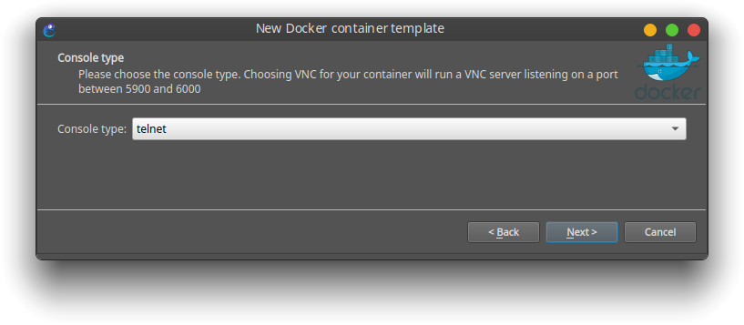
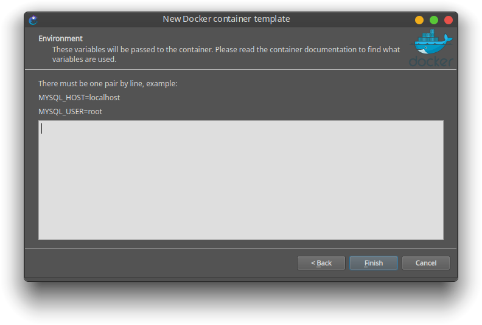

<a name="inicio"></a>
      

# Manual de Uso

### Ir a:

- [Inicio](#inicio)
- [Scripts](scripts/#scripts)
- [Docker](docker/#docker)
- [Assets](assets/#assets)

### Se explicará:

- <a href="#script"> Uso del script de instalación para: </a>

  - VirtualBox
  - GNS3
  - Docker
  - Netgui
  - Imágenes Ubuntu elaboradas para el uso de Redes

- <a href="#gns3"> Integración de imágenes Docker a GNS3 para: </a>

  - <a href="#ubuntu_host"> Uso como máquina host </a>
  - <a href="#ubuntu_router"> Uso como Router </a>
  - <a href="#ubuntu_switch"> Uso como Switch </a>
  - <a href="#template_script"> Hacerlo de forma automática con el script </a>

- <a href="#ntg"> Uso del script de ntg </a>

  - ¿Que es ntg y para que sirve?
  - Requerimientos del script

- [DockerFile](#docker)

### Requisitos

- Sistema operativo: Ubuntu o derivados
  - Focal 20.0 (LTS)
  - Eoan 19.10
  - Bionic 18.04 (LTS)
  - Xenial 16.04 (LTS)
- Conexión a Internet.
- apt como gestor de paquetes.

---

<a name="script"></a>

## Uso del script de instalación

Hay 2 versiones del script. una lenta pero segura `rae.sh` y otra más rápida pero no tan segura `rae_fast.sh` yo probé ambos scripts en máquinas virtuales. Recomiendo usar `rae_fast.sh` y si da algún error usa `rae.sh`

El script te da a escoger que paquetes deseas instalar. Cada paquete es la inicial de su nombre.

Descarga:
Puedes descargar el script desde la línea de ordenes o desde tu navegador favorito.

Descargar desde el navegador:

Descargar [rae.sh](https://srealmoreno.github.io/rae/scripts/rae.sh)  
Descargar [rae_fast.sh](https://srealmoreno.github.io/rae/scripts/rae_fast.sh)

Descargar desde línea de ordenes:

```bash
wget https://raw.githubusercontent.com/srealmoreno/rae/master/scripts/rae_fast.sh
```

Dar permisos de ejecución

```bash
chmod +x rae_fast.sh
```

Ejecución del script

```bash
sudo ./rae_fast.sh
```

Para ver ayuda -h (help en inglés)

```bash
sudo ./rae_fast.sh -h
```

Nota: Si no se pasa ningún parámetro, se instalan todos los paquetes dichos.


Por ejemplo si solo se desea instalar Docker e importar imágenes:

```bash
sudo ./rae_fast.sh -d -i
```

En la ejecución del script aparecerán los siguientes mensajes:

Configuración de Wireshark  


Configuración de GNS3  


Tienes que escoger la opción que dice 'Sí', esto es para que el usuario normal (no root) pueda usar Wireshark y GNS3

Al finalizar debes **CERRAR SESIÓN** y notáras que los iconos de las aplicaciones se agregaron. Nota: Si no lo haces dará permiso denegado al tratar de usar Docker y Wireshark

Docker no es [GUI](https://es.wikipedia.org/wiki/Interfaz_gr%C3%A1fica_de_usuario)


---

<a name="gns3"></a>

## Integración de GNS3 con Docker

- **Configuración inicial de GNS3**

Seleccionar la opción 2.  


Dejar sin cambios.  


¡Listo!  
 

<a name="consola"></a>

- **Corrigiendo / Cambiando consola predeterminada**  
  Ir a Edición -> Preferencias.  
  Click en Aplicaciones de consola (Console applications)  
  Click en Editar (Edit)  
  

> > Elegir la predeterminada del sistema o la que más te guste.  
> > **Ubuntu** (gnome) utiliza gnome-terminal  
> > **Kubuntu** (kde plasma) utiliza Konsole  
> > 

> > Luego Aplicar cambios y listo.  
> > Nota: Si se desea ejecutar una imagen con entorno gráfico, ir al apartado de 'VNC' y elegir la que más te guste. Por ejemplo _vinagre_

---

- **Agregar imágenes Ubuntu a GNS3**

<a name="template_script"></a>

_Hacerlo de forma automática con el script de instalación_

> El script tiene una opción '-p' (plantillas)
>
> ```bash
> sudo ./rae_fast.sh -p
> ```
>
> Esta opción agrega las tres plantillas correspondientes de forma automática. Pero si quieres hacerlo manualmente >puedes hacerlo.  
> Nota: Aunque que agregues las plantillas de forma automática debes de leer todo el manual de uso para tener claros los >conceptos.

<a name="ubuntu_host"></a>

_Plantilla de maquina host_

> Click en Nueva plantilla (new template)
>
> ")
>
> Seleccionar la opción 3.  
> 
>
> Click en Nuevo (new)  
> 
>
> Click en existente  
> Selecciona la imagen `srealmoreno/rae:latest`  
> 
>
> Cambia el nombre a 'ubuntu' o 'pc'  
> 
>
> Dejas la cantidad de adaptadores que gustes (adaptadores de red)  
> 
>
> Comando de inicio lo dejas vacío  
> 
>
> Tipo de consola: `telnet` ya que es en modo texto, si se desea agregar una con entorno gráfico elegir `vnc`  
> 
>
> Variables de entorno lo dejas vacío  
> 
>
> Ya que se lo hayas añadido  
> Click en editar  
> 
>
> Marca la opción de 'Auto start console'  
> Click en 'Browse' para cambiar el icono  
> 
>
> Filtras por la palabra 'Computer'  
> 

> **Volúmenes persistentes** > <a name="volumen_persistente_host"></a>

> > Ahora ve a avanzado y agrega las siguientes líneas en la segunda caja de texto (volúmenes persistentes)
> >
> > ```
> > /save
> > /etc/network
> > /etc/default
> > /root
> > ```
> >
> > GNS3 + Docker está pensado para gastar los menos recursos posibles. Ya sea memoria Ram y Disco duro.
> > **Cada vez que se cierra un contenedor de docker todos los ficheros _eliminan_**  
> > Estas rutas a ficheros y carpetas quedarán **guardadas** aunque el contenedor se cierre.
> > **Si quieres guardar un script o una captura hazlo en el directorio `/save/`**
> > Si quieres que otro fichero o carpeta se guarde, simplemente agrega la ruta **absoluta**.
> >
> > De esta manera cada práctica pesa lo menos posible, a excepción de Netgui que es muy pesado en Disco.
> >
> > Nota importante:
> > **JAMÁS agregues todo el sistema de ficheros o `'/'` porque puede dañar la maquina física.**
> >
> > [Leer&#32;más&#32;en&#32;docs&#32;GNS3](https://docs.gns3.com/1KGkv1Vm5EgeDusk1qS1svacpuQ1ZUQSVK3XqJ01WKGc/index.html#h.7s4z7hjkewuv)
> >
> > [Leer&#32;más&#32;en&#32;docs&#32;Docker](https://docs.docker.com/storage/volumes/)
> >
> > 
> >
> > Listo, se agrego el icono.  
> > 
> >
> ¡Listo!

<a name="ubuntu_router"></a>

> _Plantilla de router_
>
> Para plantilla de router es el mismo procedimiento pero con algunas modificaciones.
>
> Cambia el nombre  
> 
>
> Número de adaptadores  
> 
>
> Comando de inicio
>
> ```bash
> bash -c "/etc/init.d/frr start; vtysh; bash"
> ```
>
> De esta forma nos aseguramos que cada vez que arranque el contenedor arranque el servicio y entre a modo Cisco automáticamente
>
> 
>
> Cambia la categoría de 'End devices' a 'Router'  
> 
>
> Cambia el icono  
> 
>
> <a name="volumen_persistente_router"></a>

> y por ultimo se agregan los volúmenes persistentes
>
> ```
> /save
> /etc/network
> /etc/default
> /etc/dhcp
> /etc/frr
> /root
> ```
>
> 
>
> ¡Listo!

<a name="ubuntu_switch"></a>

_Plantilla de Switch_

> La plantilla para usar la imagen como switch es similar a la plantilla de Host
> Simplemente clona la plantilla
>
> Cambia el nombre a 'Switch'  
> 
>
> Cambia la categoría de 'End devices' a 'Switches'  
> Cambia el icono  
> Cambia el número de adaptadores  
> 
>
> ¡Listo!

---

**Topología de prueba**

> 

Para ver el consumo de los contenedores:

```bash
docker stats
```

> ¡WOW, Cada contenedor consume 4MiB de memoria RAM!
>
> 

---

<a name="tcpdump"></a>

## Corrigiendo tcpdump

> Error de tcpdump al tratar de guardar la captura con el párameto -w:
> Tcpdump: Permission denied
>
> 
>
> Este error ocurre al tratar de guardar una captura en el directorio `/save/`, por razones de seguridad el SO anfitrión >bloquea que el comando tcpdump pueda escribir archivos `'.cap'`. [AppArmor](https://es.wikipedia.org/wiki/AppArmor) es >el causante de esto.
> Hay algunas formas de solucionarlo:
>
> 1.  Escribir la salida con extensión `'.pcap'` o cualquiera diferente a `'.cap'`
>
>     En vez de:
>
>     ```bash
>     tcpdump -w /save/bla.cap
>     ```
>
>     Has esto:
>
>     ```bash
>     tcpdump -w /save/bla.pcap
>     ```
>
>       
>     
>
> 2.  Cambiar el perfil de tcpdump de `'enforce'` a `'complain'` en AppArmor (en el SO anfitrión)
>
>     Ejecutar en la máquina fisica:
>
>     ```bash
>     sudo apt-get install apparmor-utils
>     sudo aa-complain /usr/sbin/tcpdump
>     ```
>
>     
>
>     Ya puedes guardar con extensión `'.cap'`
>
>     
>
>     Para volver al perfil a la normalidad: (Recomendado cuando termines todas las prácticas)
>
>     ```bash
>     sudo aa-enforce /usr/sbin/tcpdump
>     ```
>
> 3.  Desactivar AppArmor (No recomendado)  
>     Enserio no lo hagas a menos que sepas lo que haces.
>
>     Ejecutar en la máquina fisica:
>
>     ```bash
>     sudo systemctl disable apparmor.service
>     ```
>
>     luego reiniciar la máquina
>
> 4.  Realiza la captura en otro directorio y luego copiala al directorio `/save/`  
>     Por ejemplo se puede guardar en `/root/` o `/tmp/`
>
>     
>
>     Nota: El directorio `/root/` tambien es persistente pero debes de apagar el contenedor para poder acceder a su contendio o jugar con `chmod` `chown` para acceder al contendio aún cuando este el contenedor encendido. o simplemente ejecutar `source ~/.bashrc`

---

<a name="tipsgns3"></a>

## Tips de GNS3

Video de tips de GNS3 con wireshark [video](https://youtu.be/3cGE_HKxumY)

---

<a name="ntg"></a>

## ntg

### Script para convertir topolgías de Netgui a GNS3

He creado un script para convertir topolgías completas de Netgui a GNS3, ntg (Netgui to gns3)  
Con el uso del script podrás clonar los escenarios completos que son asignados en la universidad.

Requerimientos:

> El script depende de una librería llamada `rstr`
>
> Puedes instalar la librería con el siguiente comando:
>
> ```bash
> sudo pip3 install rstr
> ```

Descargar [ntg.py](scripts/ntg.py)

Descargar desde línea de ordenes:

```bash
wget https://raw.githubusercontent.com/srealmoreno/rae/master/scripts/ntg.py
```

Dar permisos de ejecución

```bash
chmod +x ntg.py
```

Antes que todo debemos saber algunos conceptos sobre los proyectos y configuración de GNS3:  
 **Template ID**: Es el id de la plantilla para identificar los nodos en la topología

> 

**Image name**: Es la imagen Docker que se utilizará para los nodos.

> 

Para poder convertir proyectos de Netgui a GNS3 se necesita de ambos valors. **Template ID** y **Image name**

**gns3_controller.conf**: Es un archivo json que contiene todas las plantillas creadas por el usuario, el script de aquí leerá **Template ID** y **Image name** para convertir el proyecto. Como puedes observar este fichero contiene ambos datos.

> 

Para ver la ayuda puedes utilizar la opción -h

> 

El script tiene 3 subcomandos:

### Subcomando `all`

> Convierte la topología y los ficheros de configuración
>
> ```bash
> ntg.py all
> ```
>
> 
>
> **Netgui_Project_Folder**: Proyecto a convertir
>
> > **-i --image**: Será la imagen base que se utilizará para los nodos de GNS3
> > por defecto es: srealmoreno/rae:latest
> >
> > **-n --name**: Es el nombre que tendrá el proyecto de GNS3. por defecto es el nombre del proyecto de Netgui
> >
> > **-t --template**: Es el id de la plantilla que se utilizará para los nodos de GNS3 (Si no se especifica se buscará en >el fichero 'gns3_controller.conf')
> >
> > **-r --read**: Ubicación absoluta al fichero 'gns3_controller.conf', aquí se buscará el ID de la plantilla (En caso >>que no se especifique -t)
> >
> > **--o --output**: Carpeta de salida donde se guardará el proyecto convertido. por defecto es '~/GNS3/projects'
>
> Ejemplo:  
> Tengo el siguiente proyecto Netgui en la carpeta descargas:
>
> > 
>
> El archivo llamado **netgui.nkp** es la topología del proyecto, en este archivo esta la información de los nodos.  
> Los demás ficheros son los de configuración.
>
> Esta es la topología:
>
> > 
>
> ```bash
> ntg.py all ~/Descargas/IPv6-tun-lab
> 			#Ruta del proyecto netgui a convertir
> ```
>
> Como no se especifico ningún parámetro opcional. utilizó los que están por defecto.
>
> >   
> > 

### Subcomando `topology`

> Convierte unicamente la topología sin los ficheros de configuración
>
> ```bash
> ntg.py topology
> ```
>
>   
> Este subcomando es similar al anterior, la diferencia es que no copia los ficheros de configuración. Unicamente crea la topología

### Subcomando `config`

> Convierte unicamente los ficheros de configuración (Se requiere una toplogía GNS3 previamente creada)
>
> ```bash
> ntg.py config
> ```
>
> 

> > **Netgui_Project_Folder**: Proyecto Netgui donde están los archivos de configuración  
> > **GNS3_Project_Folder**: Proyecto GNS3 donde se convertirán los ficheros de configuración

> Este subcomando copia únicamente los ficheros de configuración, se requiere una topolgía GNS3 similar a la de Netgui.

---

<a name="docker"></a>

## DockerFile

Puedes ver el [manual](docker/) del archivo DockerFile o [descargarlo](https://srealmoreno.github.io/rae/docker/dockerfile) que construye la imagen base  
Si falta algún comando puedes agregarlo al dockerfile y reconstruir la imagen.

Leer [tutorial](https://docs.docker.com/get-started/part2/) oficial de Docker para construir una imagen

Ver [video](https://youtu.be/a8sf54TCRN4) tutorial construir una imagen

---

<a name="wiki"></a>

## Wiki

- Documentación oficial de [Docker](https://docs.docker.com/)  
  <a href="https://docs.docker.com/install/linux/docker-ce/ubuntu/" target="_blank"> Guía de instalación de Docker</a>

- Documentación oficial de [Gns3](https://docs.gns3.com/)  
  <a href="https://docs.gns3.com/1QXVIihk7dsOL7Xr7Bmz4zRzTsJ02wklfImGuHwTlaA4/" target="_blank"> Guía de instalación de Gns3</a>

- Documentación oficial de [VirtualBox](https://www.virtualbox.org/wiki/Documentation)  
  <a href="https://www.virtualbox.org/wiki/Linux_Downloads"> Guía de instalación de VirtualBox</a>

- [Netgui](http://mobiquo.gsyc.es/netgui/)

<a name="autores"></a>

## Autores

- **Salvador Real** - [srealmoreno](https://github.com/srealmoreno)

También puedes mirar la lista de todos los [contribuyentes](https://github.com/srealmoreno/rae/contributors) quíenes han participado en este proyecto.

<a name="licencia"></a>

## Licencia

Este proyecto está bajo la Licencia GNU General Public License v3.0 - mira el archivo [LICENSE.md](LICENSE.md) para más detalles

---

Redes de área extensa 2020 - Salvador real  


[](https://mail.google.com/mail/u/0/?view=cm&fs=1&to=salvadorreal77@gmail.com&su=Manua%20de%20uso%20RAE&body=Hola,%20Salvador%20tengo%20una%20pregunta%20acerca%20del%20manual%20del%20repositorio%20RAE.) [](https://facebook.com/srealmoreno) [](https://github.com/srealmoreno/)

<style>
blockquote{
	font-style: normal !important;
}
@media print, screen and (min-width: 1210px){
.wrapper {
    width: 95%;
}
header {
    width: 20%;
}
section {
    width: 72%;
}
footer {
    width: 20%
}
}
</style>
