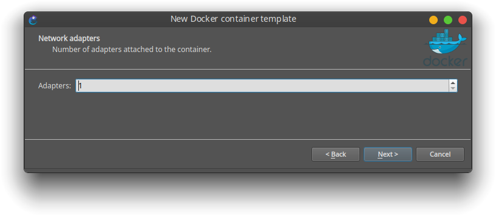

     


# Manual de Uso
===================================

### Se explicará:
- <a href="#script"> Uso del script de instalación para: </a>
	* VirtualBox
	* GNS3
	* Docker
	* Netgui
	* Imágenes Ubuntu elaboradas para el uso de Redes

- <a href="#gns3"> Integración de imágenes Docker a GNS3 para: </a>
	* <a href="#ubuntu_host"> Uso como máquina host </a>
	* <a href="#ubuntu_router"> Uso como Router </a>
	* <a href="#ubuntu_switch"> Uso como Switch </a>

### Requisitos
* Sistema operativo: Ubuntu o derivados 
	- Focal 20.0 (LTS)
	- Eoan 19.10
	- Bionic 18.04 (LTS)
	- Xenial 16.04 (LTS)
* Conexión a Internet.
* apt como gestor de paquetes.

<a name="script" id="script"></a>

## Uso del script de instalación
Hay 2 versiones del script. una lenta pero segura `rae.sh` y otra más rápida pero no tan segura `rae_fast.sh` yo probé ambos scripts en máquinas virtuales. Recomiendo usar `rae_fast.sh` y si da algún error usa `rae.sh`

El script te da a escoger que paquetes deseas instalar. Cada paquete es la inicial de su nombre.

Descarga:
Puedes descargar el script desde la línea de ordenes o desde tu navegador favorito.

Descargar desde el navegador:  
Click derecho -> Guardar Como  
Descargar [rae.sh](scripts/rae.sh)  
Descargar [rae_fast.sh](scripts/rae_fast.sh)  

Descargar desde línea de ordenes:
```bash
wget https://raw.githubusercontent.com/srealmoreno/rae/master/scripts/rae_fast.sh
```

Dar permisos de ejecución
```bash
chmod +x rae_fast.sh
```

Ejecución del script
```bash
sudo ./rae_fast.sh
```

Para ver ayuda -h (help en inglés)
```bash
sudo ./rae_fast.sh -h
```

Nota: Si no se pasa ningún parámetro, se  instalan todos los paquetes dichos.


Por ejemplo si solo se desea instalar Docker e importar imágenes:

```bash
sudo ./rae_fast.sh -d -i
```

Al finalizar debes cerrar sesión y notáras que los iconos de las aplicaciones se agregaron.

Docker no es [GUI](https://es.wikipedia.org/wiki/Interfaz_gr%C3%A1fica_de_usuario)

  

<a name="gns3" id="gns3"></a>

## Integración de GNS3 con Docker

* **Configuración inicial de GNS3**

Seleccionar la opción 2.  


Dejar sin cambios.  


¡Listo!  
 

<a name="consola" id="consola"></a>

* **Corrigiendo / Cambiando consola predeterminada**  
Ir a Edición -> Preferencias.  
Click en Aplicaciones de consola (Console applications)  
Click en Editar (Edit)  


Elegir la predeterminada del sistema o la que más te guste.  
**Ubuntu** (gnome) utiliza gnome-terminal  
**Kubuntu** (kde plasma) utiliza Konsole  


Luego Aplicar cambios y listo.  
Nota: Si se desea ejecutar una imagen con entorno gráfico, ir al apartado de 'VNC' y elegir la que más te guste. Por ejemplo *vinagre*

* **Agregar imágenes Ubuntu a GNS3**

<a name="ubuntu_host" id="ubuntu_host"></a>

*Plantilla de maquina host*  

Click en Nueva plantilla (new template)  

")

Seleccionar la opción 3.  


Click en Nuevo (new)  


Click en existente  
Selecciona la imagen `srealmoreno/rae:latest`  


Cambia el nombre a 'ubuntu' o 'pc'  


Dejas la cantidad de adaptadores que gustes (adaptadores de red)  


Comando de inicio lo dejas vacío  


Tipo de consola: `telnet` ya que es en modo texto, si se desea agregar una con entorno gráfico elegir `vnc`  


Variables de entorno lo dejas vacío    


Ya que se lo hayas añadido  
Click en editar  


Marca la opción de 'Auto start console'  
Click en 'Browse' para cambiar el icono  


Filtras por la palabra 'Computer'  


**Volúmenes persistentes**
<a name="volumen_persistente_host" id="volumen_persistente_host"></a>

Ahora ve a avanzado y agrega las siguientes líneas en la segunda caja de texto (volúmenes persistentes)  
```
/save
/etc/network
/etc/default
/root
```
GNS3 + Docker está pensado para gastar los menos recursos posibles. Ya sea memoria Ram y Disco duro.
**Cada vez que se cierra un contenedor de docker todos los ficheros _eliminan_**  
Estas rutas a ficheros y carpetas quedarán **guardadas** aunque el contenedor se cierre.
**Si quieres guardar un script hazlo en el directorio `/save/`**
Si quieres que otro fichero o carpeta se guarde, simplemente agrega la ruta **absoluta**.

De esta manera cada práctica pesa lo menos posible, a excepción de Netgui que es muy pesado en Disco.

Nota importante: 
**JAMÁS agregues todo el sistema de ficheros o `/` porque puede dañar la maquina física.**

[Leer&#32;más&#32;en&#32;docs&#32;GNS3](https://docs.gns3.com/1KGkv1Vm5EgeDusk1qS1svacpuQ1ZUQSVK3XqJ01WKGc/index.html#h.7s4z7hjkewuv)  

[Leer&#32;más&#32;en&#32;docs&#32;Docker](https://docs.docker.com/storage/volumes/)  


Listo, se agrego el icono.  


¡Listo!


<a name="ubuntu_router" id="ubuntu_router"></a>
*Plantilla de router*  

Para plantilla de router es el mismo procedimiento pero con algunas modificaciones.  

Cambia el nombre  


Número de adaptadores  


Comando de inicio  
```bash
bash -c "/etc/init.d/frr start; vtysh; bash"
```
De esta forma nos aseguramos que cada vez que arranque el contenedor arranque el servicio y entre a modo Cisco automáticamente  


Cambia la categoría de 'End devices' a 'Router'  


Cambia el icono  


<a name="volumen_persistente_router" id="volumen_persistente_router"></a>

y por ultimo se agregan los volúmenes persistentes  

```
/save
/etc/network
/etc/default
/etc/dhcp
/etc/frr
/root
```


¡Listo!


<a name="ubuntu_switch" id="ubuntu_switch"></a>

*Plantilla de Switch*

La plantilla para usar la imagen como switch es similar a la plantilla de Host
Simplemente clona la plantilla

Cambia el nombre a 'Switch'  


Cambia la categoría de 'End devices' a 'Switches'  
Cambia el icono  
Cambia el número de adaptadores      


¡Listo!

**Topología de prueba**  


Para ver el consumo de los contenedores:
```bash
docker stats
```
¡WOW, Cada contenedor consume 4MiB de memoria RAM!  


<a name="tipsgns3" id="tipsgns3"></a>
* **Tips de GNS3**  
Video de tips de GNS3 próximamente / [video](https://www.youtube.com/channel/UCXqFPKVslL_2b40djJWEc5A)

<a name="dockerfile" id="dockerfile"></a>
* **DockerFile**  
Puedes [ver](https://github.com/srealmoreno/rae/blob/master/dockerfile) el archivo [DockerFile](dockerfile/dockerfile) que construye la imagen base  
Si falta algún comando puedes agregarlo al dockerfile y reconstruir la imagen.  
Leer [tutorial](https://docs.docker.com/get-started/part2/) oficial de Docker para construir una imagen  
Ver [video](https://youtu.be/a8sf54TCRN4) tutorial construir una imagen   

<a name="wiki" id="wiki"></a>
## Wiki  
- Documentación oficial de [Docker](https://docs.docker.com/)  
<a href="https://docs.docker.com/install/linux/docker-ce/ubuntu/" target="_blank"> Guía de instalación de Docker</a>  

- Documentación oficial de [Gns3](https://docs.gns3.com/)  
<a href="https://docs.gns3.com/1QXVIihk7dsOL7Xr7Bmz4zRzTsJ02wklfImGuHwTlaA4/" target="_blank"> Guía de instalación de Gns3</a>  

- Documentación oficial de [VirtualBox](https://www.virtualbox.org/wiki/Documentation)  
<a href="https://www.virtualbox.org/wiki/Linux_Downloads"> Guía de instalación de VirtualBox</a>  

- [Netgui](http://mobiquo.gsyc.es/netgui/)

<a name="autores" id="autores"></a>
## Autores  

* **Salvador Real** - [srealmoreno](https://github.com/srealmoreno)

También puedes mirar la lista de todos los [contribuyentes](https://github.com/srealmoreno/rae/contributors) quíenes han participado en este proyecto.

<a name="licencia" id="licencia"></a>
## Licencia

Este proyecto está bajo la Licencia GNU General Public License v3.0 - mira el archivo [LICENSE.md](LICENSE.md) para más detalles

---
Redes de área extensa 2020 - Salvador real   


[](https://mail.google.com/mail/u/0/?view=cm&fs=1&to=salvadorreal77@gmail.com&su=Manua%20de%20uso%20RAE&body=Hola,%20Salvador%20tengo%20una%20pregunta%20acerca%20del%20manual%20del%20repositorio%20RAE.) [](https://facebook.com/srealmoreno) [](https://github.com/srealmoreno/)

