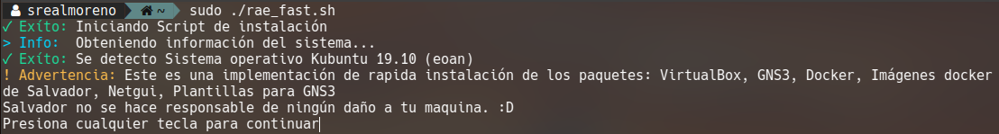
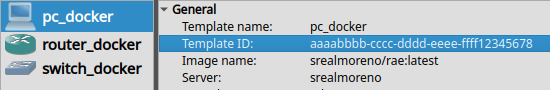
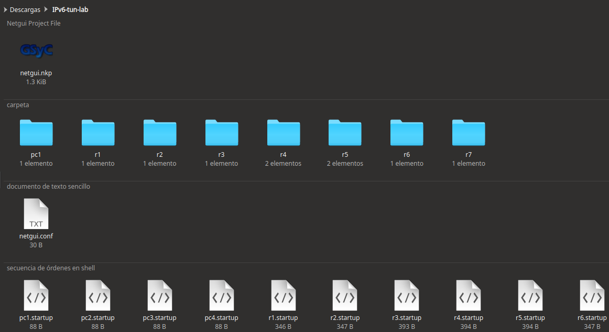
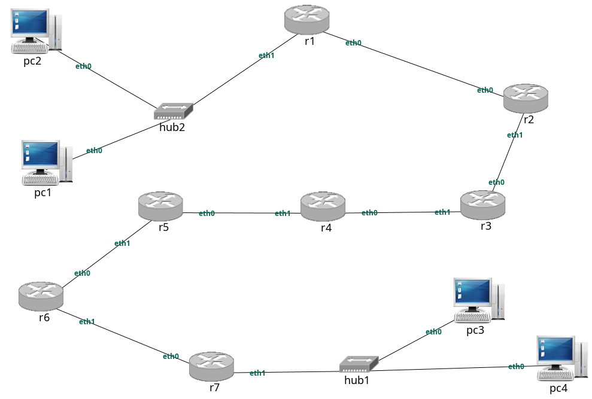
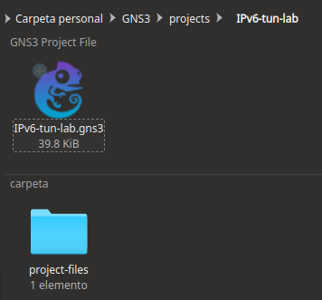
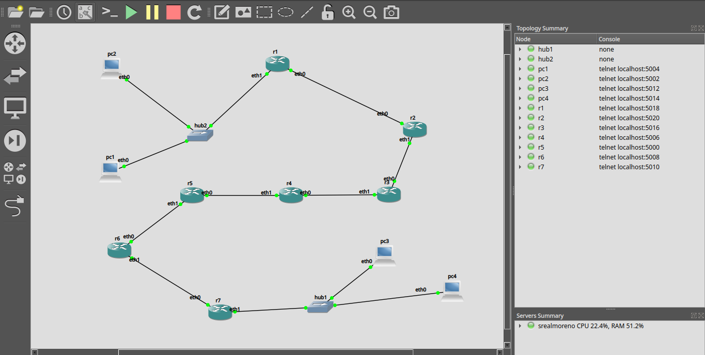

<a name="scripts"></a>
     


# Scripts

### Ir a:
* [Inicio](../)
* [Scripts](#scripts)
* [Docker](../docker/#docker)
* [Assets](../assets/#assets)

Esta carpeta contiene los scripts de:
-   Instalación de Docker
-   Instalación de GNS3
-   Instalación de VirtualBox
-   Instalación de Netgui
-   Instalación de Imágenes base 
- 	Convertir Toplogías de Netgui a GNS3


### Requisitos
* Sistema operativo: Ubuntu o derivados 
	- Focal 20.0 (LTS)
	- Eoan 19.10
	- Bionic 18.04 (LTS)
	- Xenial 16.04 (LTS)
* Conexión a Internet.
* apt como gestor de paquetes.

## Uso del script de instalación
Hay 2 versiones del script. una lenta pero segura `rae.sh` y otra más rápida pero no tan segura `rae_fast.sh` yo probé ambos scripts en máquinas virtuales. Recomiendo usar `rae_fast.sh` y si da algún error usa `rae.sh`

Perdón por no comentar el código, no me dio tiempo en 3 días, es algo largo. cualquier duda envía un correo.

El script te da a escoger que paquetes deseas instalar. Cada paquete es la inicial de su nombre.

Descarga:
Puedes descargar el script desde la línea de ordenes o desde tu navegador favorito.

Descargar desde el navegador:  

Descargar [rae.sh](rae.sh)  
Descargar [rae_fast.sh](rae_fast.sh) 


Descargar desde línea de ordenes:
```bash
wget https://raw.githubusercontent.com/srealmoreno/rae/master/scripts/rae_fast.sh
```

Dar permisos de ejecución
```bash
chmod +x rae_fast.sh
```

Ejecución del script
```bash
sudo ./rae_fast.sh
```

Para ver ayuda -h (help en inglés)
```bash
sudo ./rae_fast.sh -h
```

Nota: Si no se pasa ningún parámetro, se  instalan todos los paquetes dichos.



Por ejemplo si solo se desea instalar Docker e importar imágenes:

```bash
sudo ./rae_fast.sh -d -i
```

Al finalizar debes cerrar sesión y notáras que los iconos de las aplicaciones se agregaron.

Docker no es [GUI](https://es.wikipedia.org/wiki/Interfaz_gr%C3%A1fica_de_usuario)

  

--- 

<a name="ntg"></a>  

## ntg
### Script para convertir topolgías de Netgui a GNS3  
He creado un script para convertir topolgías completas de Netgui a GNS3, ntg (Netgui to gns3)  
Con el uso del script podrás clonar los escenarios completos que son asignados en la universidad.  

Requerimientos:  
>El script depende de una librería llamada `rstr`
>
>Puedes instalar la librería con el siguiente comando:
>```bash
>sudo pip3 install rstr
>```

Descargar [ntg.py](ntg.py) 

Descargar desde línea de ordenes:
```bash
wget https://raw.githubusercontent.com/srealmoreno/rae/master/scripts/ntg.py
```

Dar permisos de ejecución
```bash
chmod +x ntg.py
```  

Antes que todo debemos saber algunos conceptos sobre los proyectos y configuración de GNS3:  
 **Template ID**: Es el id de la plantilla para identificar los nodos en la topología  

>  

 **Image name**: Es la imagen Docker que se utilizará para los nodos.  

>  

Para poder convertir proyectos de Netgui a GNS3 se necesita de ambos valores. **Template ID** y **Image name**   

**gns3_controller.conf**: Es un archivo json que contiene todas las plantillas creadas por el usuario, el script de aquí leerá **Template ID** y **Image name** para convertir el proyecto. Como puedes observar este fichero contiene ambos datos.  

>  

Para ver la ayuda puedes utilizar la opción -h  
>


El script tiene 3 subcomandos:  

### Subcomando `all` 
>Convierte la topología y los ficheros de configuración
>```bash
>ntg.py all
>```
> 
>
>  
>
>**Netgui_Project_Folder**: Proyecto a convertir
>
>>**-i --image**:	Será la imagen base que se utilizará para los nodos de GNS3
>>			por defecto es: srealmoreno/rae:latest   
>>  
>>**-n --name**: Es el nombre que tendrá el proyecto de GNS3. por defecto es el nombre del proyecto de Netgui  
>>  
>>**-t --template**: Es el id de la plantilla que se utilizará para los nodos de GNS3 (Si no se especifica se buscará en >el fichero 'gns3_controller.conf')  
>>  
>>**-r --read**: Ubicación absoluta al fichero 'gns3_controller.conf', aquí se buscará el ID de la plantilla (En caso >>que no se especifique -t)   
>>
>>**--o --output**: Carpeta de salida donde se guardará el proyecto convertido. por defecto es '~/GNS3/projects'  
>
>Ejemplo:  
>Tengo el siguiente proyecto Netgui en la carpeta descargas:  
>
>>  
>
>El archivo llamado **netgui.nkp** es la topología del proyecto, en este archivo esta la información de los nodos.  
>Los demás ficheros son los de configuración.  
>
>Esta es la topología:
>>   
>
>```bash
>ntg.py all ~/Descargas/IPv6-tun-lab
>			#Ruta del proyecto netgui a convertir
>```
>Como no se especifico ningún parámetro opcional. utilizó los que están por defecto.  
>>   
>>  


### Subcomando `topology`
>Convierte unicamente la topología sin los ficheros de configuración
>```bash
>ntg.py topology 
>```
>  
>Este subcomando es similar al anterior, la diferencia es que no copia los ficheros de configuración. Unicamente crea la topología
>

### Subcomando `config`
>Convierte unicamente los ficheros de configuración (Se requiere una toplogía GNS3 previamente creada)
>```bash
>ntg.py config
>```
>  

>>**Netgui_Project_Folder**: Proyecto Netgui donde están los archivos de configuración  
>>**GNS3_Project_Folder**: Proyecto GNS3 donde se convertirán los ficheros de configuración  

>Este subcomando copia únicamente los ficheros de configuración, se requiere una topología GNS3 similar a la de Netgui.

---

## Netgui
Aclaro, tomé el [script](http://mobiquo.gsyc.es/netgui/netgui-autoinstall.sh) de auto instalación de netgui, modifique algunas cosas para hacerlo compatible con Ubuntu 20.0 LTS, crear un lanzador y registrar la asociación del fichero

---

## Wiki
- Documentación oficial de [Docker](https://docs.docker.com/)  
<a href="https://docs.docker.com/install/linux/docker-ce/ubuntu/" target="_blank"> Guía de instalación de Docker</a>  

- Documentación oficial de [Gns3](https://docs.gns3.com/)  
<a href="https://docs.gns3.com/1QXVIihk7dsOL7Xr7Bmz4zRzTsJ02wklfImGuHwTlaA4/" target="_blank"> Guía de instalación de Gns3</a>  

- Documentación oficial de [VirtualBox](https://www.virtualbox.org/wiki/Documentation)  
<a href="https://www.virtualbox.org/wiki/Linux_Downloads"> Guía de instalación de VirtualBox</a>  

- [Netgui](http://mobiquo.gsyc.es/netgui/)
    
<a name="autores"></a>
## Autores  

* **Salvador Real** - [srealmoreno](https://github.com/srealmoreno)

También puedes mirar la lista de todos los [contribuyentes](https://github.com/srealmoreno/rae/contributors) quíenes han participado en este proyecto.

<a name="licencia"></a>
## Licencia

Este proyecto está bajo la Licencia GNU General Public License v3.0 - mira el archivo [LICENSE.md](LICENSE.md) para más detalles

---
Redes de área extensa 2020 - Salvador real   


[](https://mail.google.com/mail/u/0/?view=cm&fs=1&to=salvadorreal77@gmail.com&su=Manua%20de%20uso%20RAE&body=Hola,%20Salvador%20tengo%20una%20pregunta%20acerca%20del%20manual%20del%20repositorio%20RAE.) [](https://facebook.com/srealmoreno) [](https://github.com/srealmoreno/)

<style>blockquote{font-style: normal !important;}</style>